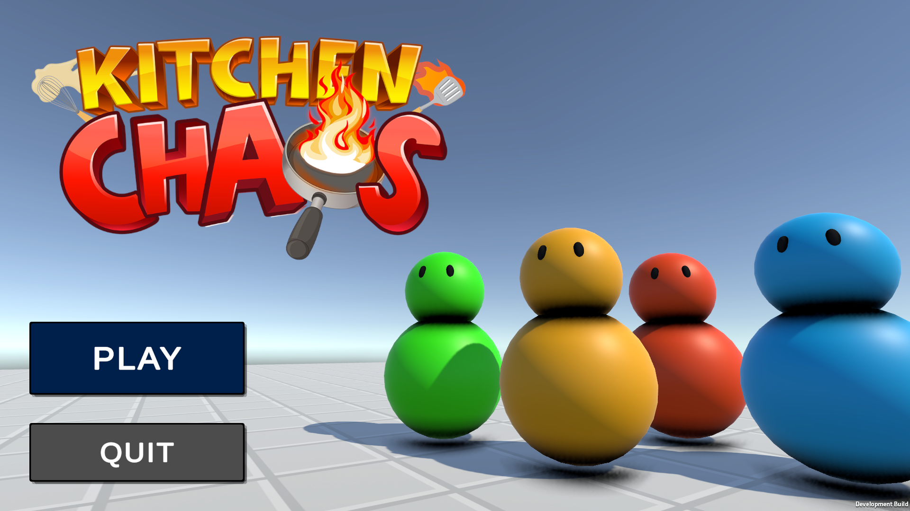
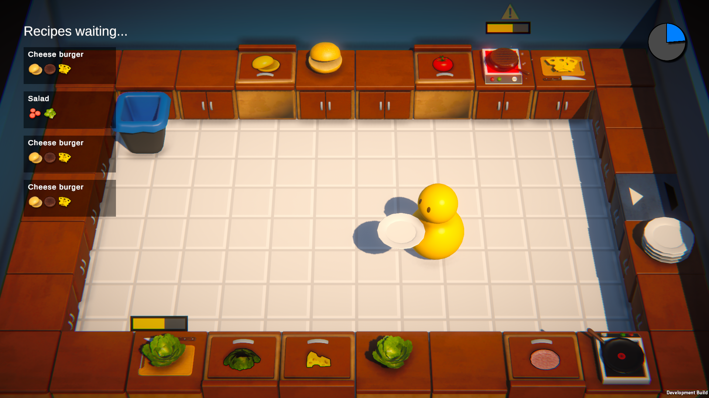
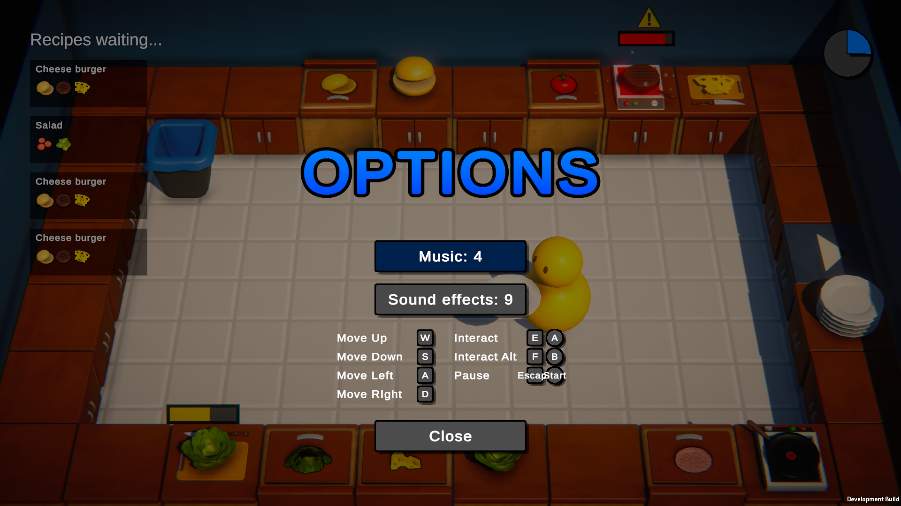
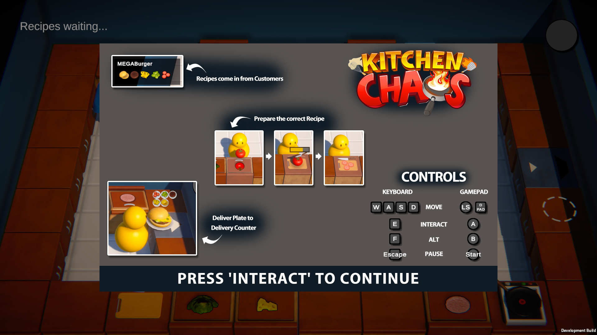

# Kitchen Caos Control

Play the game **[here](https://play.unity.com/mg/other/webgl-builds-343546)**! Or go to the *Release* section and download the game for Windows.

This is a final project for the 12 hour long *"Learn Unity Beginner/Intermediate 2023"* course by Code Monkey. The game is a clone of **Overcooked**, a game where you have to cook and serve food to customers. The game is made in **Unity** and uses `C#` as the scripting language.

The main goal of this project is to practice **production-quality** code where all logic is **separated** from the visuals, UI, audio and visual effects, to make *scalable*, *clean* and *readable* code.

> Kitchen Caos Control is a simple tool to control the chaos monkey in your kitchen.

*\- Copilot*

All code is in the [Scripts](./Assets/Scripts/) folder.

Course: [Code Monkey](https://youtu.be/AmGSEH7QcDg)

## Features

- Full keyboard and gamepad support
- Rebindable keys
- Stick sensitivity
- Save system
- Complex interactions

## Screenshots

